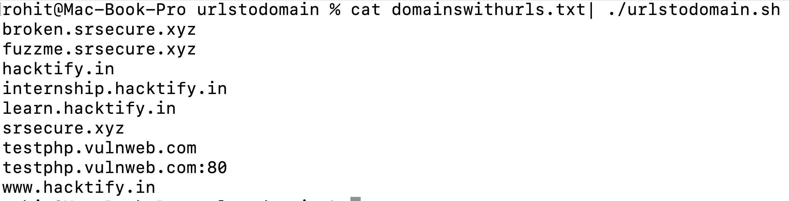

# urlstodomain
Extract domain names from a large mixed list of crawled urls implemented in bash

Steps:   
-> Assume you have a file domainswithurls.txt which has mixed urls for domains/subdomains/acqusitions etc  
-> cat domainswithurls.txt| ./urlstodomain.sh   
-> Done   

